> **文档类型**：落地需求文档（PRD）  
> **概念版**：`docs/2026-07-28-课后补抽-概念版.md`（已确认）  
> **文档版本**：v4.2  
> **最后更新**：2026-08-19  
> **范围**：课外抽奖活动、课程/大班与小班资格、课中课外中奖互斥、学生端抽奖与领奖、辅导老师中奖记录

# 课外抽奖完整 PRD

## 0. 已确认的产品决策

1. 【本次更新】本需求不修改原有课中抽奖的创建、编辑、奖品和发起逻辑。
2. 课中抽奖与课外抽奖保持独立活动 ID、奖品配置、参与记录和中奖记录；课外活动可以复制课中配置作为初始值，但复制后独立维护，不共享奖池。
3. 【本次更新】课外抽奖由运营或辅导上级统一创建、编辑、下架和配置；辅导老师在小班管理中只查看、复制可用链接，不能修改活动规则。
4. 【本次更新】课外活动可以关联课程，也可以关联大班并长期复用。系统根据“学生 → 小班 → 大班 → 课程”判断学生是否命中活动适用范围，不要求运营按周创建抽奖场次或招生期。
5. 【本次更新】每个匹配小班的学生参与窗口为“小班开课时间”至“小班最后一节课结束时间 + 2 天”。例如最后一节课于 2026-08-11 20:10 结束，该小班学生参与截止时间为 2026-08-13 20:10。
6. 课外抽奖通过独立链接参与，点击后立即开奖；同一学生在同一个课外活动中最多产生一次结果，重复请求返回首次结果。
7. 互斥规则只限制再次中奖，不限制学生进入页面或点击参与；限制选项仅有“不限制 / 已中奖不可中奖”。
8. 【本次更新】互斥关系只能从课外抽奖侧创建和维护，候选活动只能选择课中抽奖；课中抽奖不能主动选择课外活动，课中页面仅只读展示。
9. 每条由课外活动维护的关系仍支持两个业务方向：课中中奖后参与课外的限制、课外中奖后参与课中的限制。
10. 【本次更新】课中保持原有奖品数量、在线人数比例和虚拟中奖人数逻辑；课外统一使用“中奖概率 + 发放数量上限”逻辑。两侧不共享库存、不自动扣减或结转；复制奖品属于配置快照，不是实时引用。
11. 【本次更新】课外支持实物、优惠券、学贝、皮肤、勋章五类奖品混合配置。实物可设置发放数量上限，也可选择“不限量”；优惠券、学贝、皮肤、勋章默认不限量。MVP 不接入库存系统，由业务方根据库存自行配置并承担超发风险；虚拟权益沿用现有奖品发放能力。
12. 课外活动沿用现有“中奖学生范围”语义，控制中奖池但不直接控制学生能否点击参与；课中活动的原有字段与算法保持不变。
13. 【本次更新】学生实际参与截止时间取“课外活动全局结束时间”和“当前匹配小班截止时间”的较早值；同时命中多个小班时，先取各小班截止时间的最晚值，再受活动全局结束时间限制。
14. 【本次更新】“跟着老师继续学”仅对未报名正式课且命中有效售卖链接的学生展示；多个小班均有售卖链接时，按小班开课时间正序选择最早开课班级，开课时间相同再按小班 ID 升序。
15. 【本次更新】不为换班建设历史快照或迁移逻辑。学生未参与前发生换班时，资格、截止时间和售卖链接均按当前所在新小班实时判断；已产生的抽奖结果不重抽。

## 1. 产品概述

### 1.1 背景与问题

当前抽奖主要由老师在课中发起。部分学生未到课、错过发起时间或课中参与但未中奖，无法继续参与招生活动。业务希望课后通过链接让当前课程范围内的学生参与抽奖，并通过正式课入口促进转化。

开发初步方案希望在小班管理中直接复制链接，让课外抽奖完全复用该小班所属课程的课中抽奖规则。该方案适合当前“课中课后奖品一致、100% 实物中奖”的 0 元业务，但会把课中在线人数比例、课后即时开奖和奖品库存混在同一活动中，无法支持课后更换奖品或独立控制概率。

本版采用折中方案：原课中抽奖零改动；运营侧新增独立课外活动，允许复制课中奖品素材作为配置快照；课外活动按课程或大班长期复用；辅导老师只在小班管理中复制已经配置好的链接；互斥规则只由课外活动维护。

### 1.2 目标

- 不改动原课中抽奖配置的前提下，为运营提供可长期复用的独立课外抽奖活动。
- 让课中未参与、课中参与未中奖、未到课但当前小班仍处于“开课至结课后2天”窗口内的学生可以课外抽奖。
- 让课中已经中奖的学生仍能点击参与，但按课外维护的互斥规则限制再次中奖。
- 通过复制课中奖品素材降低配置成本，同时允许课外独立修改奖品和中奖比例。
- 让辅导老师在小班管理中快速复制正确链接，但不承担规则配置和库存管理责任。
- 在实物领奖、虚拟权益发放、中奖记录和正式课转化之间提供可追溯路径。

### 1.3 非目标

- 不修改原课中抽奖创建和编辑页面中的字段、算法及权限。
- 不在小班管理中创建或编辑课外抽奖，不让辅导老师配置奖品和互斥规则。
- 不做任意类型活动之间的通用互斥规则；MVP 只允许课外活动关联课中活动。
- 不做课中与课外奖品库存共享、自动扣减、自动结转或实时同步。
- 不因学生“参与过互斥活动”而禁止参与，只根据中奖记录限制再次中奖。
- 不要求运营按周创建抽奖场次或招生期，也不新增需要运营手工填写的学生链接过期时间字段。
- 不在 MVP 接入仓储库存系统、实物物流系统或新的虚拟权益发放系统。

## 2. 用户与使用场景

### 2.1 用户角色

| 角色 | 主要任务 |
| --- | --- |
| 抽奖运营/辅导上级 | 创建、复制、编辑、下架课外活动；配置适用课程或大班、奖品和互斥规则；查看活动记录 |
| 辅导老师 | 在小班管理中复制当前小班可用的课外链接；查看所带班级中奖情况及收货状态；不可修改活动配置 |
| 学生 | 打开课外链接、完成身份校验、立即抽奖、查看结果、填写地址或进入正式课 |
| 系统 | 根据学生、小班、大班、课程关系和小班上课时间校验资格；执行互斥、开奖、幂等、发放和失效控制 |

### 2.2 典型场景

1. 运营复制某个课中抽奖为独立课外抽奖，奖品素材形成快照，重新确认课外中奖比例，选择适用课程或大班，并在课外活动中关联需要互斥的课中活动。
2. 辅导老师进入小班管理，系统根据该小班所属大班和课程查询当前可用的课外活动；只有一个时直接复制链接，多个时先选择活动，没有时提示暂无可用链接。
3. 学生课中未参与或参与未中奖，打开链接后命中活动关联的课程或大班，且当前时间未超过所在小班最后一节课结束后2天，按课外规则随机获得结果。
4. 学生课中已经中奖，课后仍能点击转盘；若命中“课中中奖后课外不可中奖”规则则固定未中奖，未命中或规则为“不限制”时仍按课外规则随机；中奖记录可引导处理课中奖品。
5. 辅导老师筛选“课外抽奖”，查看学生中奖记录；课外记录没有课节，因此课节单元格为空。

## 3. 核心用户动线

> 【本次更新】为兼容 Wiki 复制与阅读，正文改用高清 PNG 流程图；可编辑的 Mermaid 源码统一放在附录 A。

### 3.1 运营配置课外抽奖

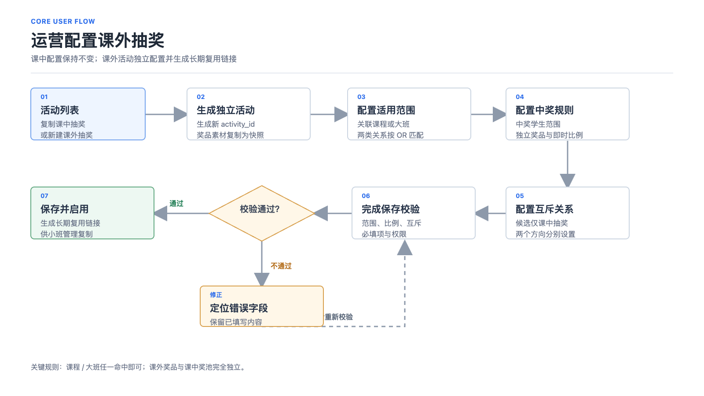

> 流程图源码见附录 A.1。

### 3.2 辅导老师复制链接

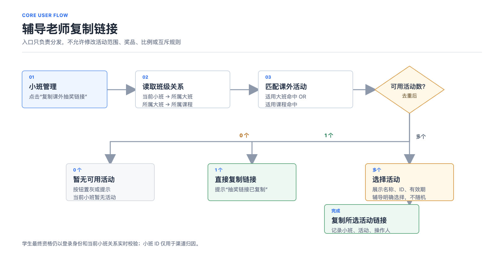

> 流程图源码见附录 A.2。

### 3.3 学生抽奖与领奖

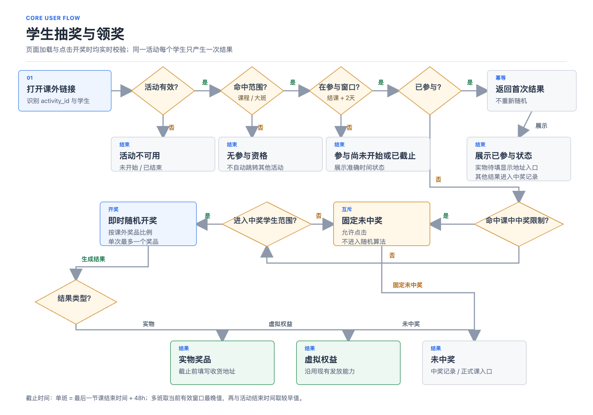

> 流程图源码见附录 A.3。

### 3.4 辅导老师查看中奖记录

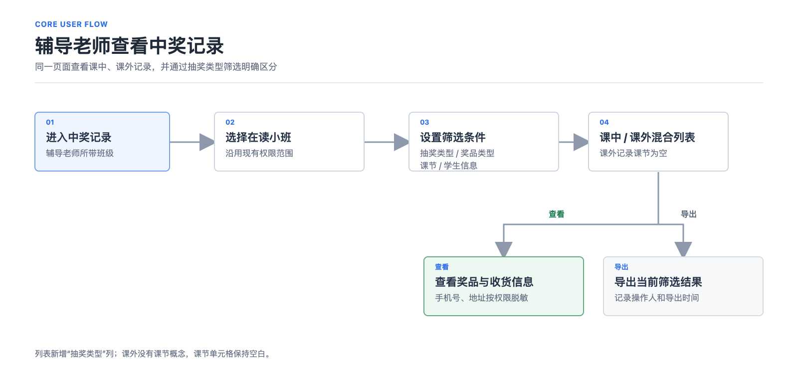

> 流程图源码见附录 A.4。

## 4. 功能清单

> 【本次更新】功能全景图用于评审时快速对齐改动范围、角色分工和本期边界；下方文字功能树作为开发拆分明细保留。

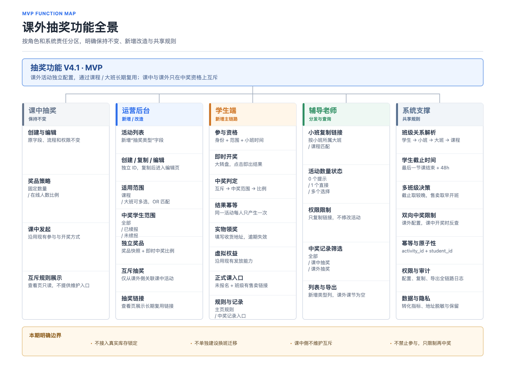

```text
抽奖功能
├── [MVP] 原课中抽奖保持不变
├── [MVP] 活动列表
│   ├── 抽奖类型字段：课中抽奖 / 课外抽奖
│   └── 保留现有查询、查看、修改、复制、下架、删除操作
├── [MVP] 运营创建/复制/编辑课外抽奖
│   ├── 独立活动ID与长期复用链接
│   ├── 中奖学生范围
│   ├── 适用范围：课程 / 大班
│   ├── 互斥抽奖配置
│   ├── 课外独立奖品与即时中奖比例
│   └── 课中奖品素材复制快照
├── [MVP] 小班管理复制课外链接
│   ├── 学生 → 小班 → 大班 → 课程匹配
│   ├── 0/1/多个可用活动状态
│   └── 辅导老师无配置权限
├── [MVP] 课外侧维护互斥抽奖
│   ├── 候选活动仅课中抽奖
│   ├── 课中中奖后参与课外的限制
│   ├── 课外中奖后参与课中的限制
│   └── 课中页面只读展示
├── [MVP] 学生端课外抽奖
│   ├── 活动、身份、课程/大班及小班时间校验
│   ├── 大转盘点击即出结果
│   ├── 已参与不可重复开奖
│   ├── 中奖结果与未中奖结果
│   ├── 小班结课后2天截止与收货地址失效
│   ├── 虚拟权益发放
│   ├── 正式课转化入口与班级售卖链接匹配【本次更新】
│   └── 规则页与中奖记录入口
├── [MVP] 学生中奖记录
│   ├── 课中抽奖/课外抽奖轻量标签
│   ├── 实物奖收货状态
│   └── 课中实物待填地址引导
└── [MVP] 辅导老师中奖记录
    ├── 抽奖类型筛选
    ├── 抽奖类型列表列
    ├── 课外记录课节为空
    └── 导出中奖记录
```

## 4.1 关键页面线框

### 4.1.1 课外抽奖编辑页

```text
┌────────────────────────────────────────────────────────────┐
│ 抽奖活动 / 编辑抽奖                         [保存]          │
├────────────────────────────────────────────────────────────┤
│ 基础信息                                                    │
│ 活动名称 [________________]   全局有效期 [开始] 至 [结束]   │
│ 中奖学生范围 (●)全部学生 ( )从已续报中抽取 ( )从未续报中抽取│
│ 适用范围 (●)课程 ( )大班  [查询并选择________________]      │
├────────────────────────────────────────────────────────────┤
│ 互斥抽奖                             [+ 添加互斥抽奖]        │
│ 互斥课中抽奖 [查询课中活动名称或ID_____________]           │
│ 课中抽奖中奖后，参与当前课外抽奖    [已中奖不可中奖▼]       │
│ 当前课外抽奖中奖后，参与课中抽奖    [不限制▼]               │
│ 已选互斥活动表格：活动 / 两个方向限制 / 编辑 / 删除          │
├────────────────────────────────────────────────────────────┤
│ 奖品设置                                                    │
│ 提示：课外抽奖奖品与课中抽奖奖品独立，请注意库存避免超发     │
│ 奖品名称 | 类型 | 图片 | 数量/比例 | 操作                   │
│ 投影仪   | 实物 | ...  | 中奖概率 10% / 上限10份 | 编辑          │
├────────────────────────────────────────────────────────────┤
└────────────────────────────────────────────────────────────┘
```

### 4.1.2 小班管理复制链接

```text
┌──────────────────────────────────────────────────────────────┐
│ 小班管理 / 小班详情                                          │
├──────────────────────────────────────────────────────────────┤
│ 小班名称 | 大班 | 所属课程 | 开课时间 | 最后一节课结束时间    │
│ 数学体验A班 | ... | 五天体验课 | 08-07 | 08-11 20:10        │
│                                      [复制课外抽奖链接]       │
└──────────────────────────────────────────────────────────────┘
```

### 4.1.3 辅导老师中奖记录

```text
┌──────────────────────────────────────────────────────────────┐
│ 中奖记录                                                      │
├──────────────────────────────────────────────────────────────┤
│ 在读小班 [选择小班]  抽奖类型 [全部▼]  奖品类型 [请选择▼]     │
│ 课节 [请选择▼]  学生 [姓名/手机号/编号]      [导出中奖记录]   │
├──────────────────────────────────────────────────────────────┤
│ 课节 | 抽奖类型 | 抽奖ID | 抽奖名称 | 发起角色 | 发起人 | ...   │
│ 课节 | 课中抽奖 | ...    | ...      | 主讲     | ...    | ...   │
│      | 课外抽奖 | ...    | ...      | 系统     | ...    | ...   │
└──────────────────────────────────────────────────────────────┘
```

### 4.1.4 已完成 Demo 截图索引

以下截图是上一版可操作 Demo 的视觉参考。涉及活动模型、小班资格和权限的内容以 v4.2 文本规则为准，截图中的演示数据和旧交互不作为最终开发依据。

| 页面 | 截图 |
| --- | --- |
| 原创建抽奖页面（参考） | 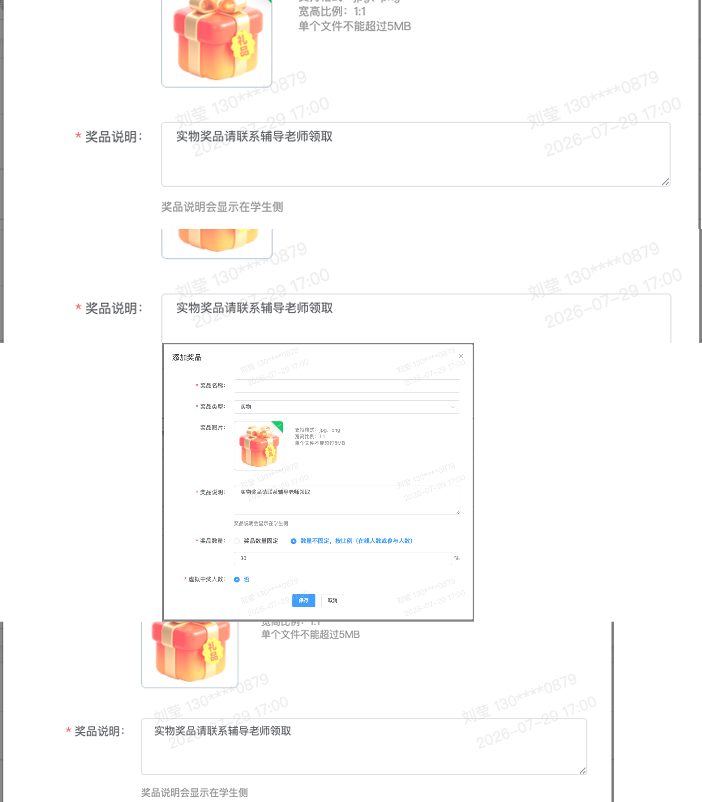 |
| 原抽奖编辑页面（参考） | 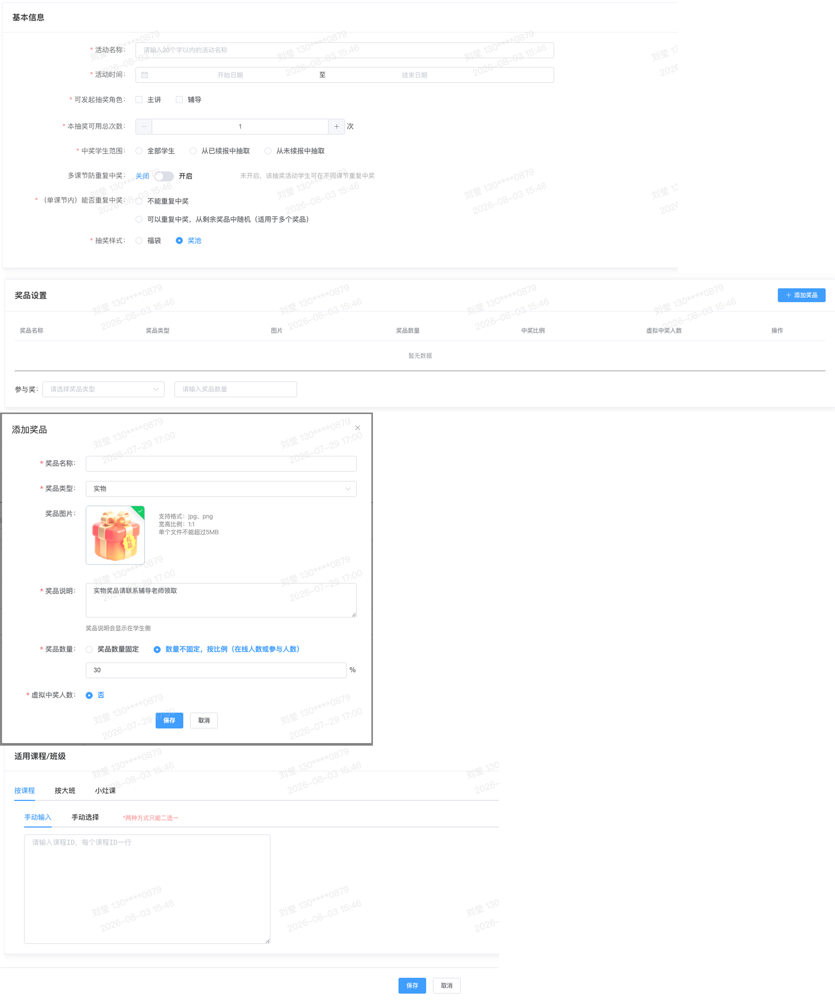 |
| 原抽奖查看页面（参考） | 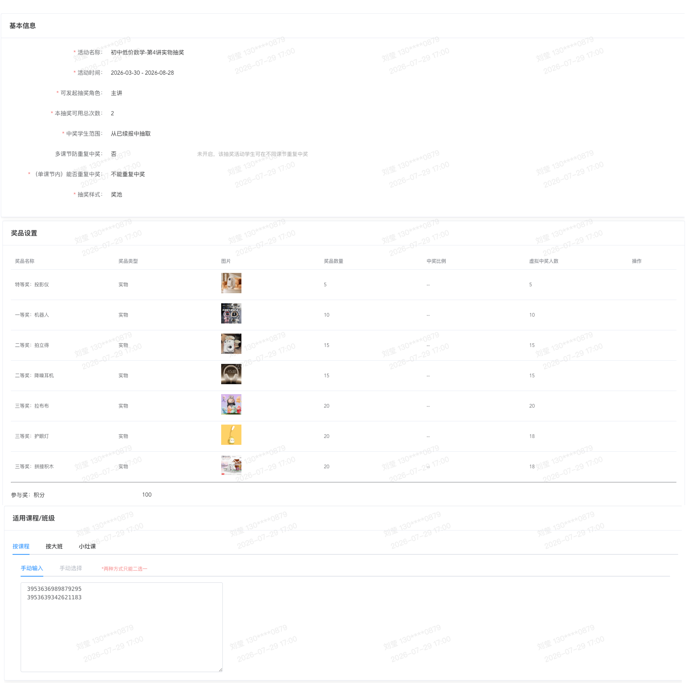 |
| 活动列表 | 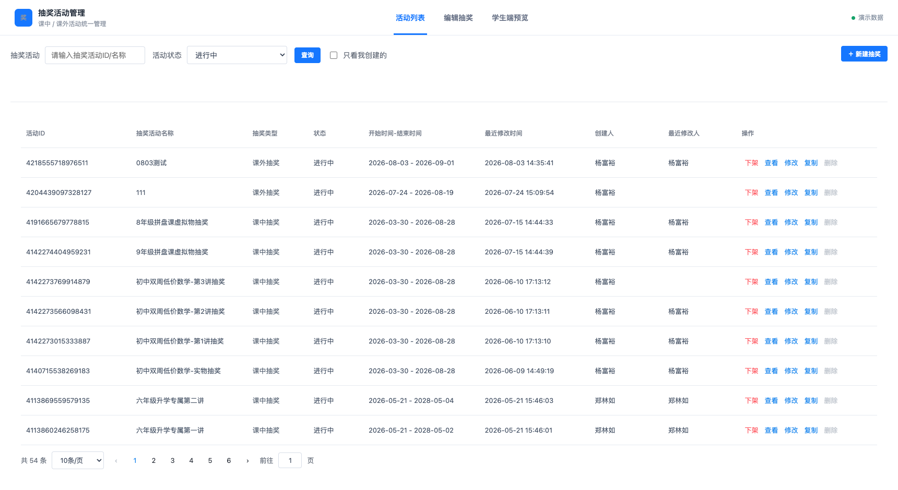 |
| 课外抽奖编辑 | 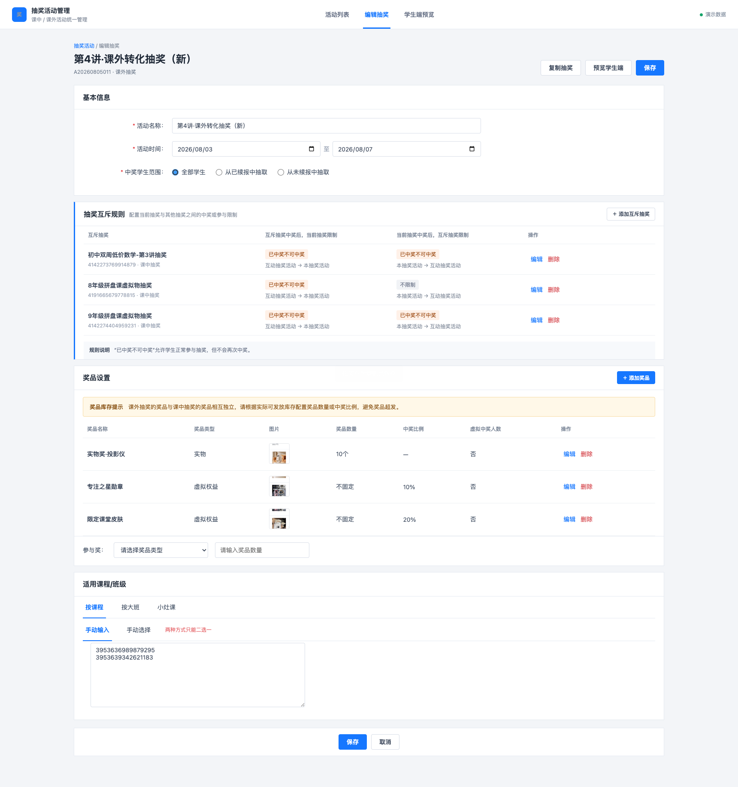 |
| 课外抽奖查看 | 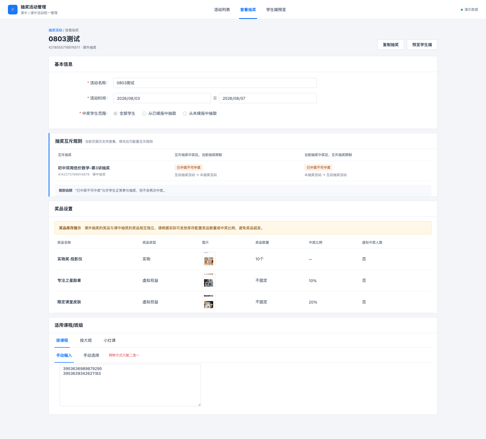 |
| 课中抽奖查看与互斥规则 | 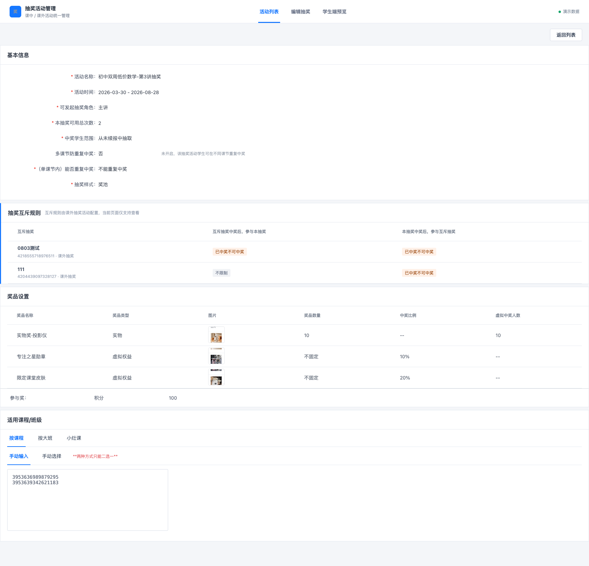 |
| 学生端转盘 | 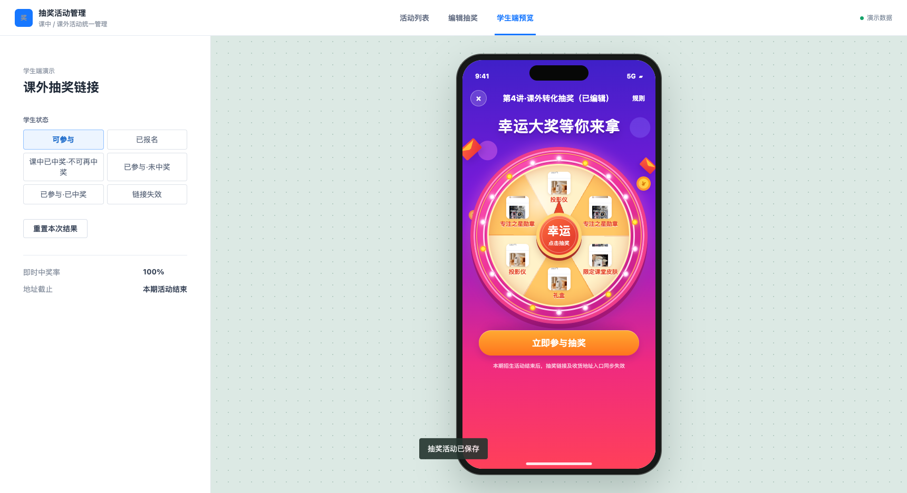 |
| 学生端中奖结果 | 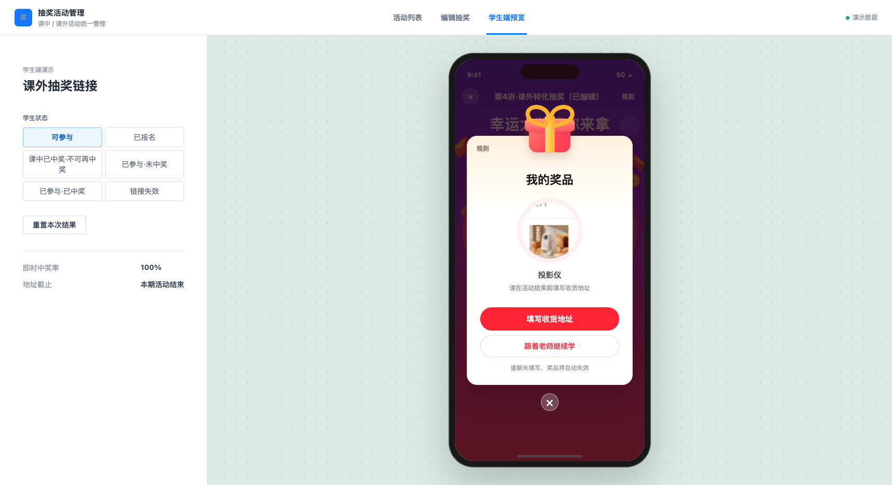 |
| 学生端收货地址 | 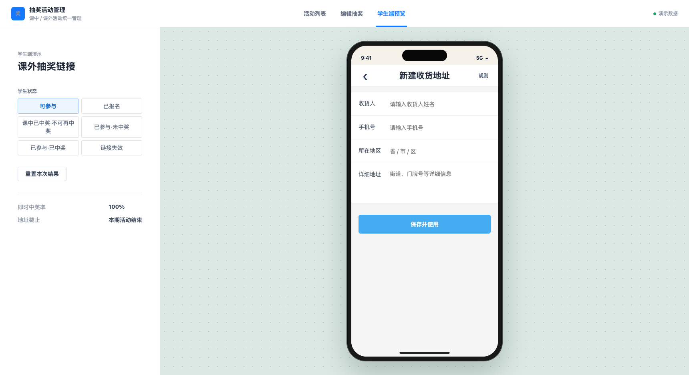 |
| 学生端中奖记录 | 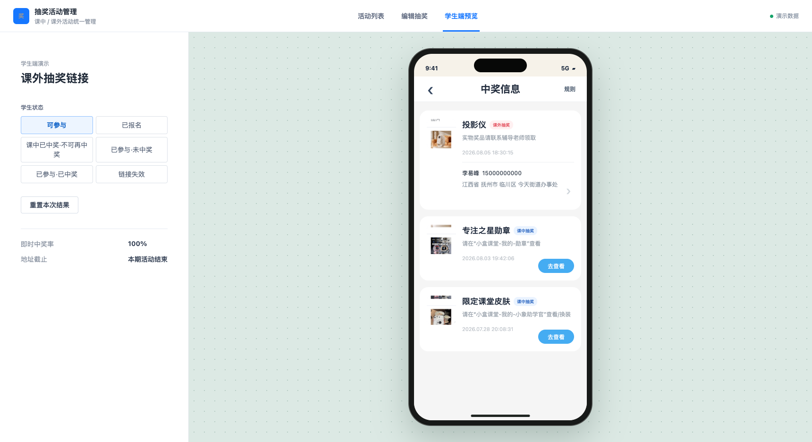 |
| 辅导老师中奖记录 | 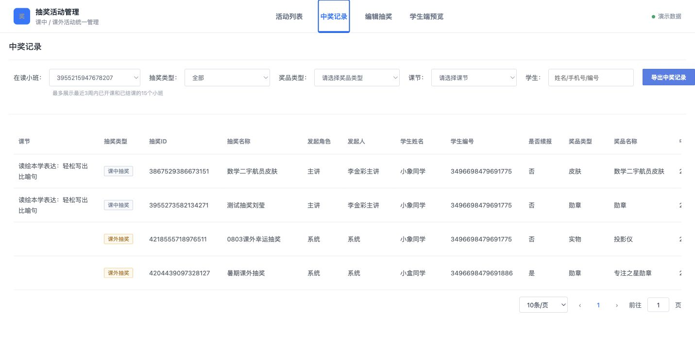 |

## 5. 详细需求

### 5.1 活动列表与活动类型

**功能描述**：原课中抽奖配置零改动；统一活动列表增加“抽奖类型”字段，用于区分课中抽奖和课外抽奖。列表其他原字段、分页和权限保持不变。


原创建页面作为字段和信息层级参考：


| 字段 | 规则 |
| --- | --- |
| 抽奖类型 | 课中抽奖 / 课外抽奖；历史数据按现有活动归类 |
| 活动 ID | 每个活动唯一；复制课中配置生成课外活动时必须生成新 ID |
| 全局有效期 | 课外活动可按季度等较长周期配置；学生参与还需满足当前匹配小班的个人参与窗口 |
| 操作 | 查看、修改、复制、下架、删除沿用原能力；删除遵循原权限和状态限制 |

**交互与状态**：

- 列表加载中显示原有加载态；无数据沿用原空状态。
- 类型只作为列表信息展示，不在本次新增单独的活动列表类型筛选。
- 点击课中活动“查看”进入原课中查看页；点击课外活动“查看”进入课外查看页。
- 查看页与编辑页分离：查看页不可添加互斥、不可修改字段；编辑页才显示保存和维护入口。
- 活动类型在草稿状态可选择；活动保存并启用或已有参与记录后不可修改类型，只能复制生成新活动。
- 原课中活动编辑页不新增课外字段、课外奖品或互斥维护入口。

**验收标准**：

- [ ] 列表每行均展示抽奖类型。
- [ ] 课中和课外活动可被正确区分并进入对应查看页。
- [ ] 原课中抽奖创建、编辑、奖品配置和发起流程无行为变化。

### 5.2 创建与复制课外抽奖

**功能描述**：仅运营或辅导上级可以在抽奖管理后台创建或复制课外活动。复制后直接进入新活动编辑页，不打开复制弹窗、不进入查看页，也不修改来源课中活动。


**复制入口与流程**：

1. 在活动列表点击“复制”，系统立即生成草稿活动 ID，并直接进入编辑页。
2. 仅复制生成的草稿编辑页在基础信息上方展示“抽奖类型”，默认等于来源活动类型；运营将类型选择为“课外抽奖”后，页面展示课外基础信息、适用范围、独立奖品和互斥配置。原有课中活动的创建页和编辑页不新增该字段。
3. 从课中活动复制为课外活动时，来源课中活动预填为一条待确认互斥关系；运营可调整两个方向的规则或删除该关系。
4. 保存前校验课外必填字段、适用课程/大班、中奖比例和互斥关系；保存成功后生成长期复用链接。
5. 复制失败不能生成半成品活动；已生成但未保存的草稿按现有草稿清理策略处理。

**复制内容**：

| 内容 | 默认处理 |
| --- | --- |
| 活动名称 | 带入，可修改；建议明确课程、学科或业务用途 |
| 全局有效期 | 带入为较长周期的编辑初始值，运营需确认；学生资格还叠加小班个人参与窗口 |
| 中奖学生范围 | 带入，可修改 |
| 适用范围 | 复制来源活动可识别的课程或大班关系；无法识别时留空并阻止保存 |
| 奖品名称、类型、图片、说明 | 复制为当前课外活动的配置快照，后续互不联动 |
| 课中奖品固定数量/在线人数比例 | 不转换为课外中奖算法，也不作为课外库存扣减依据 |
| 课外即时中奖比例 | 需要运营重新确认；从课中复制时默认留空 |
| 来源课中活动 | 记录 `source_activity_id`；预填互斥关系但需运营确认后生效 |

**边界**：来源活动无权限时阻止复制；来源活动已下架仍可作为历史配置模板复制，但页面需明确提示“来源活动已下架”，且不能据此自动启用新活动。

**验收标准**：

- [ ] 点击复制后无复制弹窗，直接进入新活动编辑页。
- [ ] 新活动 ID 与来源活动 ID 不同。
- [ ] 来源课中活动未被修改，复制的奖品为独立快照。
- [ ] 课中固定数量和在线人数比例不会被当作课外即时中奖比例或库存扣减。

### 5.3 课外抽奖编辑页

**配置角色**：只有运营或辅导上级可以进入课外活动编辑页。辅导老师无创建、编辑、保存、下架和互斥维护权限。

**基础信息**：选择课外抽奖后，仅展示以下课外必需字段，不展示课中专属的发起角色、可用次数、多课节重复中奖和抽奖样式等字段：


| 字段 | 必填 | 规则 |
| --- | --- | --- |
| 抽奖类型 | 是 | 草稿可选课中/课外；启用或产生参与记录后不可修改 |
| 活动名称 | 是 | 长度沿用原活动名称限制，超长阻止保存 |
| 全局有效期 | 是 | 开始时间早于结束时间；可按季度长期配置，作为所有学生参与时间的统一上限 |
| 中奖学生范围 | 是 | 全部学生 / 从已续报中抽取 / 从未续报中抽取 |
| 适用范围 | 是 | 支持关联一个或多个课程、一个或多个大班；两类关系为 OR，重复命中的小班去重 |

**适用范围**：课外活动可直接关联课程，也可直接关联大班，不要求运营逐周配置小班。系统从学生当前小班读取所属大班，再由大班读取所属课程；满足以下任一条件即命中活动范围：`small_class.big_class_id ∈ 活动适用大班`，或 `big_class.course_id ∈ 活动适用课程`。同一小班同时命中课程和大班时只计一次；未到课不影响资格。

**编辑与查看权限**：

- 运营/辅导上级的课外编辑页：允许修改基础信息、奖品、适用课程/大班和互斥规则。
- 课外查看页：所有字段只读，不显示“添加互斥抽奖”、编辑、删除和保存按钮。
- 课中查看页：只读展示由课外活动维护的互斥规则，不提供新增、编辑和删除入口。
- 课中原编辑能力不因本需求增加或移除任何字段。
- 辅导老师在小班管理和中奖记录页面均不能进入课外活动编辑页。


### 5.4 小班管理复制课外抽奖链接

**入口**：辅导老师进入艾欧后台“班级管理（小班）”，在小班详情或操作栏点击“复制课外抽奖链接”。该入口只负责分发，不承担活动配置。

**活动匹配链路**：

```text
当前小班
→ 读取所属大班与所属课程
→ 查询“适用大班包含该大班”或“适用课程包含该课程”的课外抽奖
→ 过滤无权限、已删除和已下架活动
```

**0 / 1 / 多活动状态**：

| 匹配结果 | 页面行为 |
| --- | --- |
| 0 个 | 按钮置灰或点击提示“当前小班暂无可用的课外抽奖” |
| 1 个 | 直接复制该活动链接，并提示“抽奖链接已复制” |
| 多个 | 打开选择弹窗，展示活动名称、活动 ID、全局有效期和状态；辅导选择后复制 |
| 活动未开始 | 允许复制，学生打开后展示活动未开始；便于提前发链接 |
| 活动已结束或已下架 | 不允许复制，并展示不可用原因 |
| 小班已超过“最后一节课结束时间 + 2天” | 不允许复制，并提示“当前小班的课外抽奖已截止” |

**链接规则**：链接携带唯一 `activity_id`，不携带可伪造的学生身份。小班 ID 可以作为渠道参数用于归因，但不能直接作为学生资格结论，最终资格以服务端登录身份和实时班级关系为准。

**验收标准**：

- [ ] 辅导老师只能复制链接，不能从小班页面修改活动名称、课程、奖品、比例和互斥规则。
- [ ] 小班可通过所属大班或所属课程匹配到课外活动，同时命中时不重复展示。
- [ ] 多个活动时必须由辅导明确选择，不随机复制其中一个。
- [ ] 复制操作记录小班 ID、活动 ID、操作者和时间。

### 5.5 互斥抽奖配置

**功能描述**：配置当前活动与互斥活动之间的中奖限制，保证学生可以参与但不会重复中奖。


**配置所有权**：互斥关系由课外活动拥有并维护。MVP 不允许课中活动主动创建或编辑与课外活动的关系；课中活动查看页只能看到关联结果。

**新增互斥弹窗**：

1. 先展示“互斥课中抽奖”查询选择框，支持按课中活动名称或活动 ID 搜索。
2. 候选活动只展示课中抽奖，默认限定为与当前课外活动适用课程或大班存在交集的活动；课程与大班交叉关联时按“大班所属课程”判断交集，隐藏已配置活动。
3. 选择课中活动后展示两个方向字段：
   - “课中抽奖中奖后，参与当前课外抽奖”
   - “当前课外抽奖中奖后，参与课中抽奖”
4. 每个字段可选：不限制、已中奖不可中奖。
5. 保存后在表格中显示活动名称、活动 ID、活动类型和两个方向的规则。

**规则语义**：

- “课中抽奖中奖后，参与当前课外抽奖 = 已中奖不可中奖”：学生若已在该课中活动中奖，当前课外活动仍允许点击，但结果不能中奖。
- “当前课外抽奖中奖后，参与课中抽奖 = 已中奖不可中奖”：学生若已在课外活动中奖，后续参与该课中活动时不能再次中奖。
- “不限制”：该方向不限制中奖。
- 任一方向只基于有效“中奖”记录，不基于“参与过”记录。
- 一个课外活动关联多个课中活动时按 OR 关系判定：命中任一课中活动的限制，当前课外结果即不能中奖。
- 关系只有一个维护入口，但包含两个业务方向；不能把“课中页面不可编辑”误解为“课外中奖不影响课中”。
- 新增、修改或删除规则只影响操作完成后的新开奖；历史结果不重新计算、不补发、不追回。
- 课中开奖时需要反向查询由课外活动维护的规则，不能依赖课中页面是否存在配置入口。

**动态一致性**：进入页面时校验一次，点击开奖前再校验一次；中奖判定、结果写入和权益发放必须幂等。

**验收标准**：

- [ ] 查询可按名称和 ID 找到同课程范围内的第 3 个课中抽奖。
- [ ] 保存后可看到多条课中互斥关系，两个方向的选项分别正确。
- [ ] 课中查看页能展示课外创建的互斥规则，但没有添加入口。
- [ ] 课外查看页不能修改互斥规则，课外编辑页可以修改。
- [ ] 课中接口不能直接新增、修改或删除互斥关系。

### 5.6 课外奖品设置与比例

**功能描述**：课外奖品独立配置，支持实物、优惠券、学贝、皮肤、勋章混合，并按中奖概率随机开奖；课中奖品字段和算法完全保持原样。

**配置规则**：

- 支持 1 个或多个奖品，类型为：实物、优惠券、学贝、皮肤、勋章。
- 每个课外奖品配置中奖概率，范围 0%–100%，最多两位小数；实物额外配置发放数量上限或“不限量”。虚拟权益默认不限量。
- 所有奖品概率合计不得超过 100%；低于 100% 时剩余概率自动为未中奖；等于 100% 仅表示进入中奖池的有效参与者没有未中奖概率，不代表一定获得实物。
- 单次开奖最多命中一个奖品。
- 课中“固定数量”“按在线人数比例”“虚拟中奖人数”只属于课中活动，不转换为课外概率或上限。
- 从课中复制的奖品名称、类型、图片和说明是一次性配置快照；复制后课中、课外任一侧修改均不联动。
- 实物设置发放上限后，达到上限即退出奖池；该奖品原概率转为未中奖，其他奖品概率不自动重新分配。选择“不限量”代表系统不限制发放数量，不代表接入真实库存。
- 课外奖品库存暂不接入系统，保存时显示提示：“课外抽奖的奖品和课中抽奖的奖品是独立的，请注意库存，避免奖品超发。”
- 虚拟权益分发沿用现有奖品能力，不新增发放、核销和过期规则。

**示例**：实物1 概率30%、上限10份；实物2 概率30%、上限10份；实物3 概率40%、上限50份。实物1耗尽后，实物2仍为30%、实物3仍为40%，剩余30%为未中奖，不自动把概率分给其他奖品。

**验收标准**：

- [ ] 比例合计大于 100% 时禁止保存并展示超出值。
- [ ] 课外奖品增删改不影响课中奖品。
- [ ] 课外支持实物、优惠券、学贝、皮肤、勋章五类奖品；实物可设置上限或不限量，虚拟权益默认不限量。
- [ ] 实物达到发放上限后退出奖池，原概率转为未中奖，其他奖品概率不自动重分配。
- [ ] 每个学生最终只有一个确定结果。

### 5.6.1 中奖学生范围与中奖池

**功能描述**：活动的“中奖学生范围”决定哪些有效参与者可以进入中奖池。它与“活动适用课程/大班及小班参与窗口”是两个不同维度：适用范围与参与窗口决定能否进入活动，中奖学生范围决定本次是否有机会命中奖品。

**范围选项**：

| 配置 | 可参与人群 | 可中奖人群 | 不在中奖范围内的学生 |
| --- | --- | --- | --- |
| 全部学生 | 命中适用课程/大班且小班参与窗口有效的学生 | 全部有效参与者 | 无 |
| 从已续报中抽取 | 命中适用课程/大班且小班参与窗口有效的学生 | 续报状态为“已续报”的有效参与者 | 可以点击，但结果固定为未中奖 |
| 从未续报中抽取 | 命中适用课程/大班且小班参与窗口有效的学生 | 续报状态为“未续报”的有效参与者 | 可以点击，但结果固定为未中奖 |

**判定规则**：

1. 先按活动适用课程/大班、学生当前小班关系和小班参与窗口判断是否有资格进入活动。
2. 学生可以进入抽奖页并点击参与；不因不在中奖范围内而展示“无参与资格”。
3. 点击开奖时，读取抽奖时刻的续报状态，生成本次中奖池快照。
4. 学生不在中奖范围内时，参与记录正常写入，但开奖结果为未中奖，不占用其他学生的奖品名额。
5. 续报状态为“未知 / 查询失败”时，允许参与但默认不进入中奖池，并记录查询异常；不得因为状态异常发放奖品。
6. 课中活动完全沿用原有的在线人数、固定数量和中奖学生范围算法，本需求不向课中算法新增过滤步骤。
7. 课外活动按过滤后的中奖池执行即时中奖比例；比例合计100%不代表所有点击学生都中奖，只代表进入中奖池的有效参与者按配置获得结果。

**推荐服务端开奖顺序**：

```text
活动有效性
→ 学生身份
→ 学生/小班/大班/课程关系与小班参与窗口
→ 本活动是否已参与（幂等返回首次结果）
→ 当前课外活动维护的课中互斥记录
→ 续报状态查询与中奖池过滤
→ 课外即时中奖算法
→ 写入命中范围、学生截止时间、参与结果和发奖状态
```

**跨活动中奖规则**：

- 课外活动开奖时，查询该课外活动关联的课中中奖记录；只要任一关系的“课中中奖后参与课外”配置为已中奖不可中奖，当前结果不能中奖。
- 课中活动开奖时，反向查询以该课中活动为目标的课外规则；如果学生已在课外中奖且“课外中奖后参与课中”为已中奖不可中奖，则课中不能再次中奖。
- 学生在其他未配置互斥的活动中中奖，不影响当前活动。
- 中奖范围过滤和互斥限制都导致“不中奖”时，统一写入一个不中奖结果，并记录命中原因，供老师和数据分析使用。

**验收标准**：

- [ ] 配置“从已续报中抽取”时，未续报学生可以点击但不能中奖。
- [ ] 配置“从未续报中抽取”时，已续报学生可以点击但不能中奖。
- [ ] 课外活动使用本节中奖范围语义，课中原算法不被本需求改写。
- [ ] 课外比例100%时，范围外学生仍可能得到未中奖结果。
- [ ] 课外侧已配置的两个方向规则能分别在课外开奖和课中开奖前生效。

### 5.6.2 学生端活动入口与小班资格

**入口**：学生通过业务分享的课外抽奖链接进入，页面标题使用活动名称，主标题为“幸运大奖等你来拿”，大转盘样式暂定沿用 Demo 方案。


**抽奖页固定元素**：

- 顶部活动名称。
- 右上角“规则”，仅在抽奖主页面展示，点击进入独立规则页。
- 转盘和“立即参与抽奖”按钮；点击即开奖。
- 底部动态文案：“本次抽奖及收货地址入口有效至 {student_lottery_deadline_at}”。时间展示到分钟；不展示“每个用户只有1次抽奖机会”。
- 学生参与后，页面右下角展示轻量“中奖记录”入口。

#### 大转盘奖品展示规则

转盘是中奖结果的视觉展示和动效载体，不承担概率计算。服务端先完成资格、互斥、中奖学生范围、库存和概率判定，前端再播放动画并展示已保存的最终结果。

**展示规则**：

- 转盘至少展示 3 个视觉扇区。
- 无论奖品概率合计是否为 100%，始终展示“谢谢参与”扇区。
- 只有 1 个真实奖品时，增加“幸运奖”作为视觉占位；幸运奖只做视觉占位，不参与概率、库存、中奖记录或发奖。
- 最多展示 8 个真实奖品；超过 8 个时，只展示奖品配置顺序前 8 个。
- 未展示的奖品仍参与服务端中奖策略；学生端不展示具体中奖概率，扇区数量不代表实际概率占比。
- 0 个真实奖品时不允许启用活动，需先配置至少 1 个奖品。

**展示数量对照**：

| 真实奖品数量 | 学生端转盘展示内容 |
| ---: | --- |
| 0 个 | 不允许启用活动 |
| 1 个 | 真实奖品 + 幸运奖占位 + 谢谢参与 |
| 2 个 | 真实奖品 1～2 + 谢谢参与 |
| 3 个 | 真实奖品 1～3 + 谢谢参与 |
| 5 个 | 真实奖品 1～5 + 谢谢参与 |
| 8 个 | 真实奖品 1～8 + 谢谢参与 |
| 超过 8 个 | 前 8 个真实奖品 + 谢谢参与 |

支持的真实奖品类型：实物、优惠券、学贝、皮肤、勋章。

**库存耗尽规则**：

- 实物库存耗尽后继续保留在转盘中，图片、名称和位置不变，不展示“已兑完”等状态。
- 服务端不再返回该奖品，并将该奖品原配置概率直接转为未中奖；其他奖品概率不自动重新分配。
- 当奖品概率合计小于 100% 时，“谢谢参与”对应真实未中奖结果；合计等于 100% 时，“谢谢参与”仅作视觉展示，服务端不会返回未中奖结果，除非有效奖品因库存耗尽等原因转为未中奖。

示例：实物1 30%、库存耗尽；勋章 30%；皮肤 20%；未中奖 20%。实际开奖为实物1 0%、勋章 30%、皮肤 20%、未中奖 50%。

**开奖与结果展示**：

1. 学生点击“立即参与抽奖”，服务端校验资格、互斥、中奖学生范围、库存和概率。
2. 服务端生成并保存唯一结果，前端播放转盘动画；前端不能根据本地随机数、指针位置、扇区顺序或动画时长生成结果。
3. 动画结束后展示服务端结果；若命中的奖品未在前 8 个扇区中，转盘照常播放，结果弹窗展示完整奖品名称、图片和领取方式。

**接口字段**：

| 字段 | 说明 |
| --- | --- |
| `display_prizes` | 转盘展示的真实奖品，最多 8 个 |
| `display_no_win` | 是否展示谢谢参与，固定为 `true` |
| `display_placeholder` | 是否展示幸运奖占位 |
| `hidden_prize_count` | 未展示奖品数量 |
| `result_prize_id` | 实际中奖奖品 ID |
| `result_prize_name` | 实际中奖奖品名称 |
| `result_prize_image` | 实际中奖奖品图片 |
| `result_type` | 中奖 / 未中奖 |

**资格判断顺序**：

1. 课外活动是否启用，且当前时间处于活动全局有效期。
2. 学生身份是否登录并能识别到学生 ID。
3. 查询学生当前所在小班，并读取每个小班所属大班、课程、开课时间和最后一节课结束时间。
4. 是否至少存在一个小班，其所属大班命中活动适用大班，或所属课程命中活动适用课程。
5. 对每个匹配小班计算参与窗口：`small_class_start_at <= now < last_lesson_end_at + 48h`。
6. 是否至少存在一个当前有效参与窗口，并计算学生本次截止时间。
7. 是否已参与本次课外抽奖。
8. 是否命中该课外活动维护的课中中奖限制。

身份失败、所有匹配小班均未开课、所有匹配小班均超过结课后2天或未命中适用课程/大班时，不生成参与记录。

**截止时间计算**：

- 单个匹配小班：`class_lottery_deadline_at = last_lesson_end_at + 48h`。按中国标准时间精确增加48小时，保留原时、分、秒；例如 `2026-08-11 20:10 → 2026-08-13 20:10`。
- 同时命中多个小班：先过滤当前已满足 `small_class_start_at <= now < class_lottery_deadline_at` 的小班，再取这些小班的 `class_lottery_deadline_at` 最大值作为 `matched_class_deadline_at`。
- 学生实际参与截止时间：`student_lottery_deadline_at = min(activity_end_at, matched_class_deadline_at)`；活动尚未开始时仍不可参与。
- 尚未开课的小班不参与当前截止时间计算；如果后续该班开课且学生仍未参与，可按当时的新窗口重新获得资格。
- 页面加载和点击开奖时均按学生当前所在小班实时计算，不为换班保留旧班资格快照。换班后按新小班所属大班/课程和时间重新判断。
- 开奖成功仍记录当时命中的 `eligibility_class_ids`、`matched_scope_types` 和 `student_lottery_deadline_at` 用于审计，但这些字段不作为换班后的资格兜底。
- 同一活动始终按 `activity_id + student_id` 保证一次结果；换班不会产生第二次开奖机会。

### 5.6.3 多班级、多学科与多链接资格

**核心原则：资格判断与入口选择分离。** 抽奖链接中必须携带唯一 `activity_id`，学生打开哪个链接，系统就只判断这个活动，不根据学生的全部班级自动猜测或切换到另一个活动。

#### 本期规则

1. **课程和大班是 OR 关系**：一个活动可关联多个课程和多个大班；学生任一当前小班命中其中一个条件且处于参与窗口，即获得资格。同一小班重复命中需去重。
2. **当前链接优先**：学生打开体验课课外链接时，只校验该活动绑定的课程/大班。学生同时报名低价课，不会被自动切换到低价课活动。
3. **未创建活动不影响当前活动**：低价课班级没有创建课外活动时，学生仍可正常参与已经打开的体验课活动。
4. **多个活动独立处理**：如果学生同时属于多个学科的班级，并且多个学科都创建了课外链接，那么每个链接都是独立活动。学生打开哪个链接，就校验并参与哪个活动；每个活动分别执行一次参与幂等。
5. **不做隐式兜底跳转**：当前链接无资格时，展示“你暂不符合本次抽奖活动的参与条件”，不自动跳转到学生可能有资格的其他活动，避免把不同学科、不同招生活动混在一起。
6. **活动名称必须明确**：学生抽奖页顶部展示活动名称；业务发送链接时应同时展示课程/学科和活动名称，帮助学生知道自己参与的是哪一个活动。
7. **跨活动重复中奖**：本期不以“学生拥有多个班级”为重复中奖条件。课中课外之间是否限制再次中奖，只使用课外活动维护的互斥规则。
8. **换班按当前关系判断**：不迁移旧班资格、不维护换班历史规则。学生未参与前换班，立即使用新班的大班/课程归属和上课时间；已参与后仍返回原结果，不重新开奖。

#### 典型判断示例

| 学生状态 | 打开的链接 | 结果 |
| --- | --- | --- |
| 体验课班 + 低价课班；只有体验课有链接 | 体验课链接 | 体验课活动有资格，正常参与 |
| 体验课班 + 低价课班；两个活动都有链接 | 体验课链接 | 只校验体验课活动，正常参与 |
| 体验课班 + 低价课班；两个活动都有链接 | 低价课链接 | 只校验低价课活动，正常参与 |
| 数学班 + 英语班；两个学科都有链接 | 数学链接 | 参与数学活动，不跳英语活动 |
| 学生当前小班不属于活动关联课程或大班 | 任一链接 | 当前活动无资格，不自动换链 |
| 学生命中范围，但所有小班尚未开课 | 当前活动链接 | 展示活动未开始，不生成参与记录 |
| 学生命中范围，最后一节课结束不足2天 | 当前活动链接 | 仍可参与，显示精确截止时间 |
| 学生命中范围，但所有小班均已结课超过2天 | 当前活动链接 | 展示本期抽奖已截止，不允许抽奖或填写地址 |
| 学生同时命中两个当前有效小班 | 当前活动链接 | 截止时间取两个小班“结课+2天”的较晚值，只生成一次结果 |

#### 后续扩展：统一活动组入口

如果业务确认“同一个学生在多个学科的课外活动中最多只能抽一次”，需要新增“招生抽奖活动组”，而不是继续扩大班级匹配逻辑：

- 活动组拥有一个统一入口链接，链接不直接指向单个活动。
- 组内活动配置优先级或明确的选择规则，例如按课程归属、业务指定优先级或最近开始时间。
- 系统先计算学生命中的活动集合，再按组规则选择一个活动。
- 参与幂等键升级为 `student_id + activity_group_id`，同时保留 `student_id + activity_id` 作为活动级记录。
- 组内选择规则、跨学科公平性和已有链接兼容需要单独评审，不纳入本期 MVP。

**本期验收标准**：

- [ ] 链接只校验自身 `activity_id` 的适用课程/大班，不受学生其他未关联班级干扰。
- [ ] 同一活动命中多个有效小班时只生成一次结果，学生截止时间取当前有效小班截止时间的最晚值。
- [ ] 多个学科活动同时存在时，不自动跳转、不混淆活动名称。
- [ ] 同一学生可分别参与多个独立课外活动；课中课外限制只读取课外侧维护的互斥关系。
- [ ] 学生换班后按新班关系和上课时间重新校验；已参与结果不重新开奖。

### 5.7 学生端状态与页面行为

| 场景 | 是否可点击抽奖 | 结果 | 主要页面操作 |
| --- | --- | --- | --- |
| 课外活动全局未开始 | 否 | 无 | 展示活动开始时间 |
| 课外活动全局已结束或已下架 | 否 | 无 | 抽奖链接不可参与，地址入口同步关闭 |
| 当前小班未命中适用课程或大班 | 否 | 无 | 展示无参与资格 |
| 命中范围但所有小班尚未开课 | 否 | 无 | 展示本期课程尚未开始 |
| 命中范围且处于任一小班参与窗口 | 是 | 继续资格与开奖校验 | 展示精确到分钟的参与截止时间 |
| 所有匹配小班均已结课超过2天 | 否 | 无 | 展示本期抽奖已截止，地址入口同步关闭 |
| 未参与课中抽奖 | 是 | 按课外比例随机 | 实物填地址、虚拟权益发放、未中奖转化 |
| 课中参与未中奖 | 是 | 按课外比例随机 | 与未参与课中的路径相同 |
| 课中未参与但已到其他课节 | 是 | 按课外比例随机 | 与普通有效学生相同 |
| 课中已中奖，且命中“课中中奖后课外不可中奖” | 是 | 固定未中奖 | 结果页显示“查看中奖记录”，引导处理课中奖品 |
| 课中已中奖，但未配置互斥或该方向为“不限制” | 是 | 按课外比例随机 | 按本次课外结果进入领奖或未中奖流程 |
| 已参与本次课外且未中奖 | 否 | 返回首次未中奖结果 | 点击按钮弹窗，下方按钮为“查看中奖记录” |
| 已参与本次课外且中实物待填地址 | 否 | 返回首次实物结果 | 弹窗按钮为“填写收货地址” |
| 已参与本次课外且中实物已填地址 | 否 | 返回首次实物结果 | 展示奖品和地址，可在有效期内查看/编辑 |
| 已参与本次课外且中虚拟奖 | 否 | 返回首次虚拟结果 | 不显示地址入口 |
| 抽奖前已报名正式课 | 依抽奖资格决定 | 正常或固定未中奖 | 隐藏“跟着老师继续学”，地址入口不受影响 |
| 【本次更新】抽奖前未报名，命中1个有效售卖链接 | 依抽奖资格决定 | 正常或固定未中奖 | 显示“跟着老师继续学”，点击进入该班级报名 H5 |
| 【本次更新】抽奖前未报名，命中多个有效售卖链接 | 依抽奖资格决定 | 正常或固定未中奖 | 按小班开课时间正序选择最早开课班级，不随机 |
| 【本次更新】抽奖前未报名，但无有效售卖链接 | 依抽奖资格决定 | 正常或固定未中奖 | 隐藏“跟着老师继续学” |
| 正式课报名或售卖链接查询异常 | 依抽奖资格决定 | 正常或固定未中奖 | 默认隐藏转化入口并记录异常 |
| 学生不在中奖学生范围 | 是 | 固定未中奖 | 仍可查看结果和中奖记录 |

**已参与弹窗**：

- 标题：“您的抽奖机会已用完哦~”。
- 说明：“无法再参与本次抽奖活动了哦~”。
- 未中奖时按钮：“查看中奖记录”。
- 实物待填地址时按钮：“填写收货地址”。
- 按钮置于弹窗底部，弹窗打开后不再显示“规则”入口。

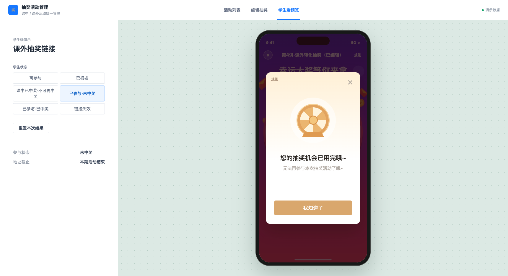

**结果弹窗**：

- 中奖：展示“中奖啦”“我的奖品”、奖品图片和奖品名称。
- 实物中奖：展示“请在页面显示的截止时间前填写收货地址”和“填写收货地址”；截止时间按学生当前小班规则计算。
- 虚拟中奖：展示虚拟权益发放状态，不显示地址按钮。
- 未中奖：使用占位图和“谢谢参与”，不展示“已中奖不能再中奖”“谢谢参与”下方解释性小字等旧提示；底部保留“查看中奖记录”；【本次更新】仅在学生未报名且命中有效售卖链接时展示“跟着老师继续学”。
- 课中已中奖导致本次固定未中奖时，显示“查看中奖记录”，用于引导查看并填写课中实物地址。


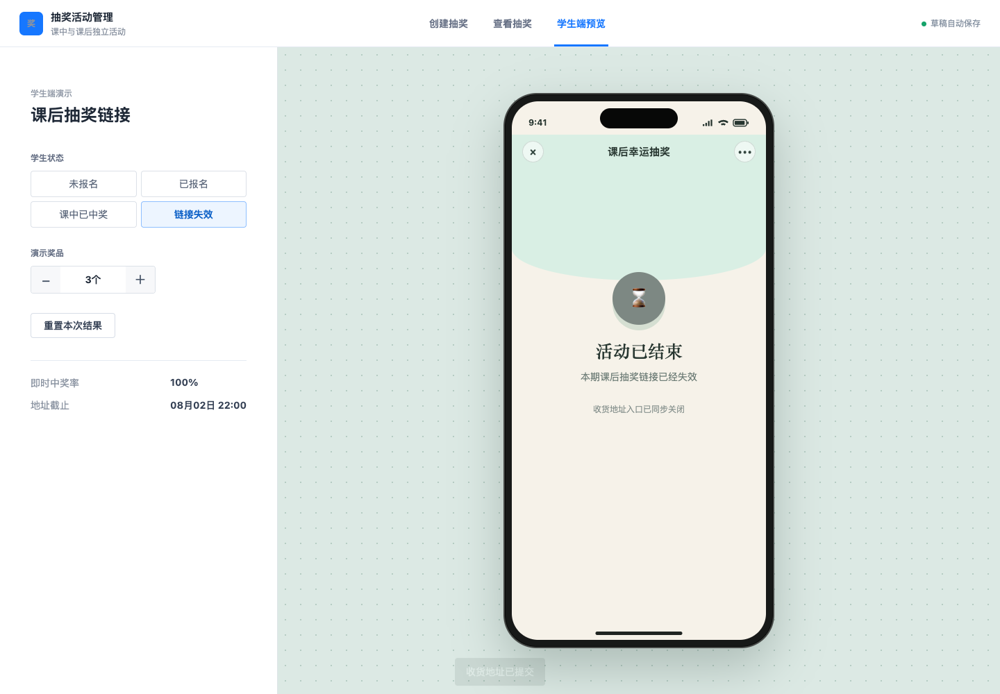

### 5.7.1 【本次更新】正式课转化入口与售卖链接匹配

**目标**：仅向仍有转化需求、且存在可访问报名页面的学生展示“跟着老师继续学”，避免已报名学生重复触达，也避免按钮点击后无可用页面。

#### 展示条件

以下条件必须同时满足，按钮才展示：

1. 学生正式课报名状态为“未报名”。
2. 学生至少属于一个命中本抽奖活动适用课程或大班、且当前参与窗口有效的小班。
3. 资格候选小班中至少有一个已启用、未失效的售卖链接。
4. 正式课报名状态和售卖链接查询均成功。

任一条件不满足时隐藏“跟着老师继续学”，但不影响抽奖、中奖记录或实物收货地址入口。

#### 候选班级集合

服务端按以下交集生成候选集合：

`学生当前所在小班 ∩ 命中活动适用课程或大班 ∩ 当前参与窗口有效 ∩ 已配置有效售卖链接的小班`

- 学生所属但未命中本抽奖适用课程或大班的小班，不参与报名 H5 选择。
- 班级已配置但链接已停用、已过期或缺少 URL 时，不进入候选集合。
- 候选集合为空时隐藏按钮，不使用学生其他班级的链接兜底。

#### 多班级选择规则

本期不随机选择，按以下稳定顺序确定唯一报名页：

1. 将所有候选小班按 `small_class_start_at` 正序排列，优先选择开课时间最早的小班。
2. 多个小班开课时间完全相同时，按 `class_id` 升序选择。
3. 只对已配置有效售卖链接的候选小班排序；开课最早的小班无有效链接时，不进入候选集合。

【本次更新】售卖链接选择不依赖活动关联关系的配置顺序。无论活动通过课程还是大班命中，最终都统一回到学生当前小班，按小班开课时间排序。

随机选择会造成同一学生多次打开时跳转不同页面，并影响渠道归因、问题排查和转化数据，因此不采用。若学生换班，下一次页面加载按新班候选集合重新计算售卖链接。

#### 点击与异常处理

- 点击“跟着老师继续学”后，跳转服务端返回的 `sale_h5_url`，不得由前端自行拼接班级链接。
- 跳转前记录选中的 `sale_class_id`、抽奖 `activity_id`、学生 `student_id` 和点击时间，用于转化归因。
- 点击时若链接已失效，展示“报名页面暂不可用，请联系辅导老师”，并阻止跳转；不得随机切换到其他班级链接。
- 报名 H5 的登录态、支付和报名流程沿用现有能力，不在本需求内改造。

#### 接口返回

学生端活动/结果接口新增以下字段：

| 字段 | 类型 | 说明 |
| --- | --- | --- |
| `show_course_entry` | Boolean | 是否展示“跟着老师继续学” |
| `sale_class_id` | String / Null | 最终选中的班级 ID；不展示时为空 |
| `sale_class_name` | String / Null | 最终选中的小班名称，用于日志和问题排查 |
| `sale_class_start_at` | DateTime / Null | 最终选中小班的开课时间，用于排序校验和问题排查 |
| `sale_h5_url` | String / Null | 对应报名 H5；不展示时为空 |
| `course_entry_hidden_reason` | Enum / Null | `ENROLLED`、`NO_VALID_LINK`、`STATUS_QUERY_FAILED`、`LINK_QUERY_FAILED` |

前端只依据 `show_course_entry` 控制按钮展示，并使用接口返回的 `sale_h5_url` 跳转，不在客户端重复计算候选班级。

### 5.8 规则页

- 仅抽奖主页面右上角展示“规则”。
- 规则页展示活动全局时间、课程/大班资格、小班“最后一节课结束后2天”的截止规则、每个活动仅一次结果、重复中奖限制和虚拟权益发放说明。
- 结果弹窗、收货地址页、中奖记录页右上角不展示“规则”。
- 规则页支持返回抽奖主页面，不产生参与记录。

### 5.9 收货地址与失效

**实物中奖流程**：

1. 学生从结果弹窗点击“填写收货地址”。
2. 进入地址列表页，可选择已有地址或新增地址。
3. 新增/编辑地址页提交姓名、手机号、地区和详细地址。
4. 保存成功后关闭原弹窗，进入中奖记录页，展示奖品和地址信息。


**有效期规则**：

- 收货地址入口与该学生当前课外抽奖参与截止时间一致：`address_deadline_at = student_lottery_deadline_at`。
- 地址页每次打开和提交时，均按学生当前所在小班重新计算 `student_lottery_deadline_at`。学生换班后使用新小班所属大班/课程、开课时间和最后一节课结束时间，不沿用旧班截止时间。
- 当前时间达到 `address_deadline_at` 后，地址填写、修改和提交均不可用；活动全局结束时间早于小班截止时间时，以活动全局结束时间为准。
- 实物奖逾期未填写地址，奖品状态变为“已失效”，不再允许补填。
- 已填写地址的中奖记录可查看历史信息；超过当前计算截止时间后不可编辑。
- 地址页和中奖记录页不显示“规则”。

**数据校验**：姓名必填；手机号符合手机号格式；地区和详细地址必填；提交前脱敏显示已保存手机号。

### 5.10 虚拟权益发放

- 沿用现有勋章、皮肤等虚拟权益发放能力。
- 学生端展示发放中、已发放、发放失败三种状态。
- 发放失败支持重试或沿用现有人工处理入口，不影响抽奖结果幂等性。
- 虚拟权益不进入收货地址流程。

### 5.11 学生中奖记录

**页面**：沿用现有中奖记录页面，卡片左上角或右上角增加轻量标签：`课中抽奖` / `课外抽奖`，不使用大面积突出样式。


**记录内容**：活动名称、抽奖类型、奖品名称、中奖时间、实物收货状态和地址入口。

**交互**：

- 课中实物中奖待填地址，记录卡显示“填写收货地址”。
- 课外实物中奖待填地址，记录卡显示“填写收货地址”。
- 已填地址显示地址摘要；有效期内可编辑，过期后只读。
- 未中奖记录可保留用于结果追溯，但不得显示为中奖奖品卡。

### 5.12 辅导老师中奖记录

**入口**：辅导老师进入“辅导老师所带班级 → 中奖记录”。


**筛选项**：

| 筛选项 | 规则 |
| --- | --- |
| 在读小班 | 沿用现有小班选择范围 |
| 抽奖类型 | 全部、课中抽奖、课外抽奖 |
| 奖品类型 | 沿用现有奖品类型筛选 |
| 课节 | 课中课节；课外记录不参与课节匹配 |
| 学生 | 姓名/手机号/学生编号 |

**列表字段**：课节、抽奖类型、抽奖 ID、抽奖名称、发起角色、发起人、学生姓名、学生编号、是否续报、奖品类型、奖品名称、中奖时间、收货信息。

**课外特殊规则**：课外没有课节概念，课外记录“课节”单元格为空，不显示“--”、无课节或虚构课节。

**权限与导出**：辅导老师只能查看所带班级；导出结果遵循当前筛选条件和现有权限，导出操作记录审计日志。

## 6. 数据与接口需求

### 6.1 核心实体

| 实体 | 关键字段 |
| --- | --- |
| 抽奖活动 | activity_id、name、lottery_type、start_at、end_at、winner_scope、status、source_activity_id |
| 活动适用范围 | relation_id、activity_id、scope_type（COURSE/BIG_CLASS）、scope_id、created_at |
| 奖品 | prize_id、activity_id、prize_type、name、image、quantity_mode、quantity_value、instant_rate |
| 课中课外互斥规则 | rule_id、post_activity_id、class_activity_id、class_to_post_rule、post_to_class_rule、created_by、updated_at |
| 参与记录 | participation_id、activity_id、student_id、eligibility_class_ids、matched_scope_types、student_lottery_deadline_at、participated_at、result_id、idempotency_key |
| 中奖结果 | result_id、activity_id、student_id、prize_id、result_type、result_status、address_deadline_at、deadline_calculated_at、created_at |
| 收货地址 | address_id、student_id、result_id、recipient、phone、region、detail、submitted_at、editable_until |
| 链接复制日志 | activity_id、class_id、operator_id、copied_at |

### 6.2 核心接口行为

- `GET /lottery/{activityId}`：返回活动状态、奖品展示、命中的当前小班、课程/大班资格、`student_lottery_deadline_at`、首次结果状态和转化入口。
- 资格状态枚举：`ACTIVITY_NOT_STARTED`、`ACTIVITY_ENDED`、`NO_SCOPE_MATCH`、`CLASS_NOT_STARTED`、`CLASS_WINDOW_EXPIRED`、`ELIGIBLE`、`ALREADY_PARTICIPATED`；前端按枚举展示对应页面，不自行推断。
- `POST /lottery/{activityId}/participate`：再次校验活动、当前小班参与窗口、课程/大班范围、互斥和中奖范围，完成开奖及结果写入；按 activity_id + student_id 幂等。
- `GET /lottery/{activityId}/result`：返回首次结果，不能重新随机。
- `POST /lottery/{resultId}/address`：校验结果归属、实物奖状态和 `address_deadline_at` 后保存。
- `GET /admin/classes/{classId}/offclass-lotteries`：读取小班所属大班和课程，返回任一范围命中的课外活动、学生截止时间及状态。
- `POST /admin/classes/{classId}/offclass-lotteries/{activityId}/copy-log`：记录辅导复制链接行为，不修改活动配置。
- `GET /student/winning-records`：返回课中、课外记录及来源标签。
- `GET /teacher/winning-records`：按班级、抽奖类型、奖品类型、课节、学生筛选。
- `GET/POST/PUT/DELETE /admin/post-lottery/{activityId}/class-mutual-rules`：仅课外活动的运营编辑角色可维护课中互斥关系。
- `GET /admin/class-lottery/{activityId}/related-post-rules`：课中页面只读查询由课外活动维护的关系。

### 6.3 一致性与幂等

- 互斥中奖查询、随机结果生成、参与记录和结果写入必须在同一事务或等价原子流程中完成。
- 相同活动 ID + 学生 ID 的重复请求返回首次结果，不重复扣减、不重复发奖。
- 并发请求只能成功写入一条参与记录和一条结果记录。
- 页面加载时校验一次当前小班资格和截止时间，点击开奖时必须再次校验，避免学生在页面停留期间超过结课后2天或班级关系发生变化。
- 地址页打开和提交时必须按当前小班重新计算 `address_deadline_at`，并校验结果归属学生、奖品类型和地址状态。
- 互斥规则变更只影响变更后的新开奖；历史参与、中奖、未中奖和发放结果全部保持不变。
- 课中奖品配置复制到课外时必须生成独立奖品记录，禁止两个活动引用同一可变奖品配置记录。

## 7. 文案规范

| 场景 | 文案 |
| --- | --- |
| 活动类型 | 课中抽奖 / 课外抽奖 |
| 模块名称 | 互斥抽奖 |
| 互斥活动说明 | 课中抽奖中奖后，参与当前课外抽奖；当前课外抽奖中奖后，参与课中抽奖 |
| 互斥选项 | 不限制 / 已中奖不可中奖 |
| 库存提示 | 课外抽奖的奖品和课中抽奖的奖品是独立的，请注意库存，避免奖品超发 |
| 学生主标题 | 幸运大奖等你来拿 |
| 学生底部提示 | 本次抽奖及收货地址入口有效至 {student_lottery_deadline_at} |
| 已参与弹窗 | 您的抽奖机会已用完哦~ / 无法再参与本次抽奖活动了哦~ |
| 未中奖按钮 | 查看中奖记录 / 跟着老师继续学 |
| 【本次更新】正式课入口异常 | 报名页面暂不可用，请联系辅导老师 |
| 实物待填地址 | 填写收货地址 / 请在 {address_deadline_at} 前完成填写 |
| 规则入口 | 规则 |
| 失效页面 | 活动已结束 / 本期抽奖已截止 / 收货地址入口已同步关闭 |

## 8. 非功能性需求

### 8.1 性能与可用性

- 抽奖页首屏在目标移动网络下 P95 不超过 3 秒。
- 资格查询和开奖接口 P95 不超过 1.5 秒；开奖动画不得早于服务端结果落库。
- 关键抽奖接口可用性目标不低于 99.9%；接口失败允许用户重试。

### 8.2 权限与审计

- 运营或辅导上级拥有课外活动创建、复制、编辑、下架和互斥维护权限。
- 课中抽奖权限和配置能力完全沿用原逻辑；课中页面不能维护互斥规则。
- 辅导老师可以在所带小班复制匹配的课外链接、查看中奖记录，但不能修改任何抽奖配置。
- 记录活动创建、复制、类型修改、适用课程/大班变更、奖品比例修改、互斥关系新增/修改/删除、活动下架、链接复制和地址修改日志。

### 8.3 安全与隐私

- 学生链接不直接暴露可伪造的学生身份；必须登录或完成可信身份换取。
- 收货手机号在老师列表和非本人页面中脱敏展示。
- 地址、学生编号和中奖记录只向有权限的本人或老师角色开放。
- 所有公网访问和接口调用使用 HTTPS；具体域名、备案和部署方案由运维确认。
- 仅采集资格判断、发奖和转化所需的最小学生信息，保留期限标记为 `[待补充：法务/隐私评审]`。

### 8.4 兼容性

- 学生端支持微信内置浏览器、现有 App 内嵌 WebView 和主流移动浏览器。
- 后台支持公司常用桌面浏览器，宽表格允许横向滚动。
- 适配 375px 及以上移动宽度；转盘、弹窗、地址表单不得出现文字重叠或按钮溢出。

## 9. 数据指标

- 课外链接访问人数、有效资格人数、参与人数和参与率。
- 按关联类型、课程、大班和小班统计链接复制次数、访问人数、资格通过率和无资格原因。
- 课中未参与、课中未中奖、课中已中奖三类学生的课外参与率。
- 互斥限制命中人数及来源活动。
- 各奖品中奖人数、中奖比例、未中奖人数。
- 实物地址填写率、逾期失效率、地址修改率。
- 虚拟权益发放成功率。
- “跟着老师继续学”展示人数、点击率和正式课转化率。
- 【本次更新】按 `activity_id + sale_class_id` 统计入口展示、点击、报名到达和支付转化；同时记录候选班级数量及隐藏原因。
- 辅导老师中奖记录查询和导出次数。

## 10. 待确认与风险

- [ ] `[待补充：法务/隐私评审]`：学生收货地址、手机号和中奖记录的保存期限及脱敏规则。
- [ ] `[待补充：现有奖品能力负责人]`：虚拟权益发放失败后的人工补发和重试入口是否完全沿用现有实现。
- [ ] `[待补充：运营负责人]`：课外活动比例低于100%时未中奖结果的业务文案是否需要特殊配置。
- [ ] `[待补充：权限负责人]`：具体哪些上级角色拥有课外活动编辑权限，以及是否需要按业务线隔离可见课程。
- [ ] `[待补充：课程数据负责人]`：小班开课时间、最后一节课结束时间、所属大班、所属课程和当前在班状态的准确字段及中国标准时间口径。
- [ ] 风险：MVP 不接入真实库存，业务配置不当可能超发；后台必须持续展示库存提示并在数据看板监控实际中奖量。
- [ ] 已知边界：课外活动按 `activity_id + student_id` 限制一次结果；学生换班或重新报班后，已经参与过该活动仍返回历史结果，不获得第二次开奖机会。
- [ ] 风险：同一学生同时命中多个小班时采用最晚截止时间会扩大参与窗口；该规则用于避免随机选班导致提前失效，需在测试数据中覆盖。
- [ ] 风险：同一课程配置多个可用课外活动时，辅导必须明确选择链接；系统不得随机或默认复制第一个。
- [ ] 风险：互斥规则修改只影响新开奖，运营需理解不会追溯改变历史结果。

## 附录 A. 流程图源码（Mermaid）

> Wiki 中以正文 PNG 为准。本附录用于后续修改节点和连线；当规则变更时，需同步重新导出正文图片。

### A.1 运营配置课外抽奖

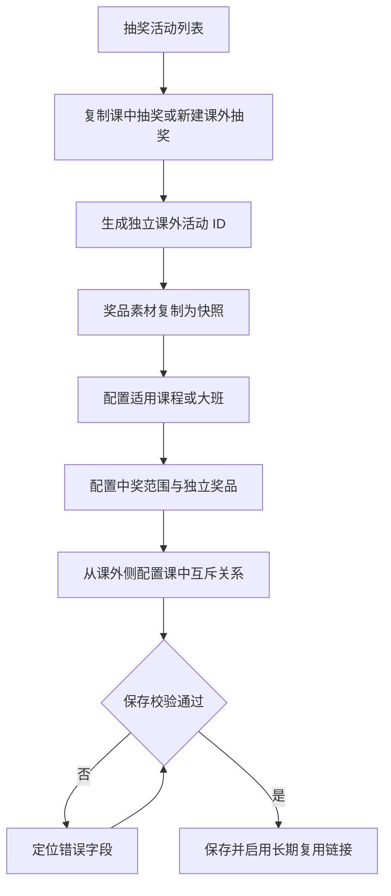
```mermaid
flowchart TD
    A[抽奖活动列表] --> B[复制课中抽奖或新建课外抽奖]
    B --> C[生成独立课外活动 ID]
    C --> D[奖品素材复制为快照]
    D --> E[配置适用课程或大班]
    E --> F[配置中奖范围与独立奖品]
    F --> G[从课外侧配置课中互斥关系]
    G --> H{保存校验通过}
    H -->|否| I[定位错误字段]
    I --> H
    H -->|是| J[保存并启用长期复用链接]
```

### A.2 辅导老师复制链接

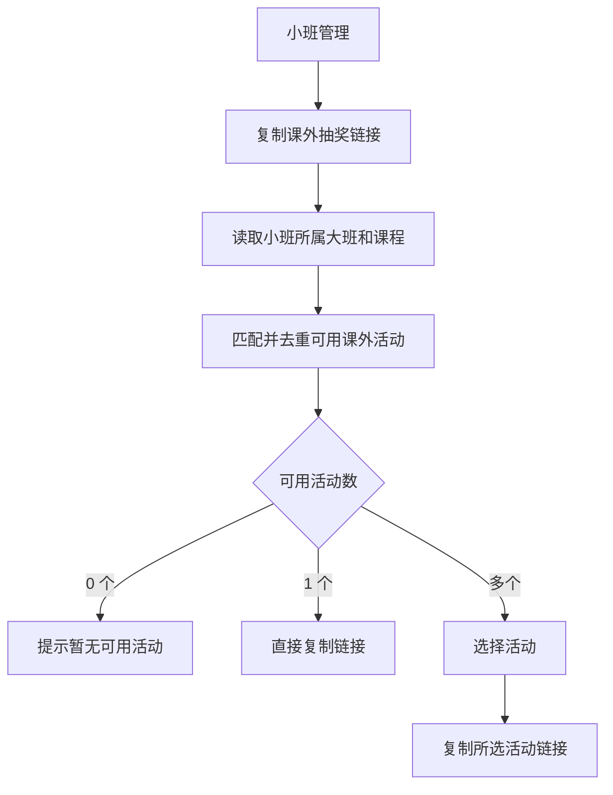
```mermaid
flowchart TD
    A[小班管理] --> B[复制课外抽奖链接]
    B --> C[读取小班所属大班和课程]
    C --> D[匹配并去重可用课外活动]
    D --> E{可用活动数}
    E -->|0 个| F[提示暂无可用活动]
    E -->|1 个| G[直接复制链接]
    E -->|多个| H[选择活动]
    H --> I[复制所选活动链接]
```

### A.3 学生抽奖与领奖

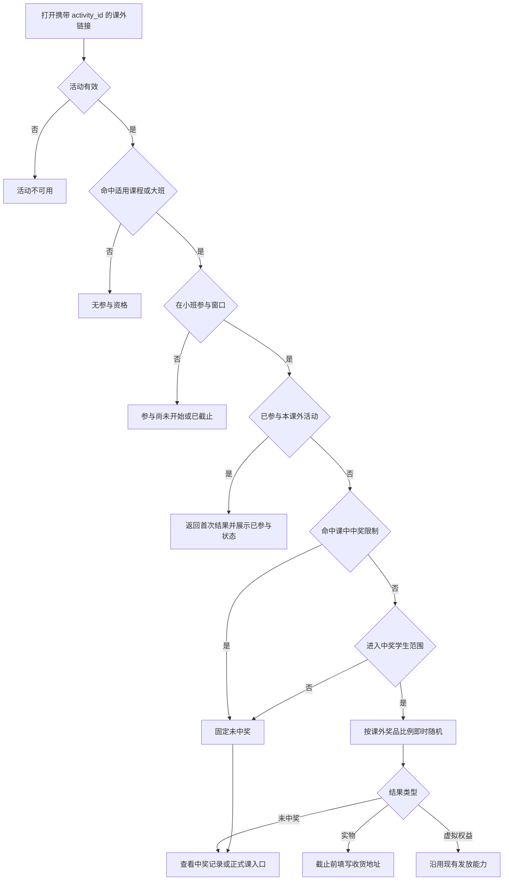
```mermaid
flowchart TD
    A[打开携带 activity_id 的课外链接] --> B{活动有效}
    B -->|否| X[活动不可用]
    B -->|是| C{命中适用课程或大班}
    C -->|否| Y[无参与资格]
    C -->|是| D{在小班参与窗口}
    D -->|否| Z[参与尚未开始或已截止]
    D -->|是| E{已参与本课外活动}
    E -->|是| F[返回首次结果并展示已参与状态]
    E -->|否| G{命中课中中奖限制}
    G -->|是| H[固定未中奖]
    G -->|否| I{进入中奖学生范围}
    I -->|否| H
    I -->|是| J[按课外奖品比例即时随机]
    J --> K{结果类型}
    K -->|实物| L[截止前填写收货地址]
    K -->|虚拟权益| M[沿用现有发放能力]
    K -->|未中奖| N[查看中奖记录或正式课入口]
    H --> N
```

### A.4 辅导老师查看中奖记录

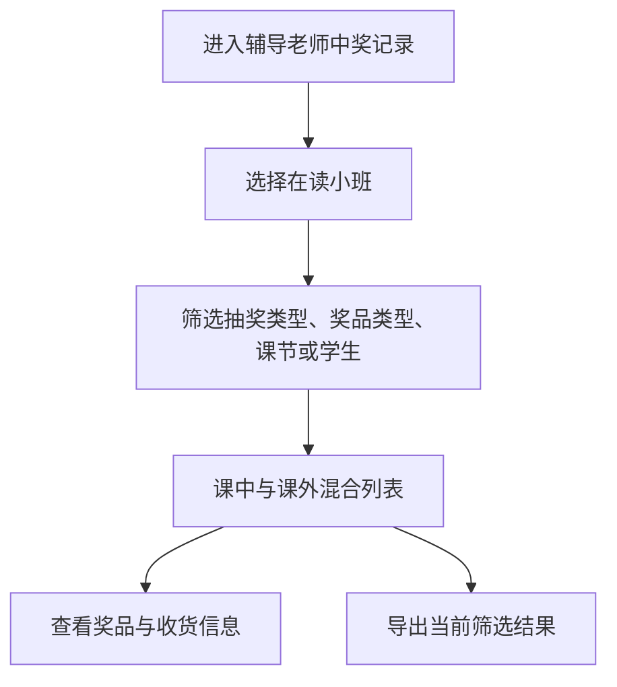
```mermaid
flowchart TD
    A[进入辅导老师中奖记录] --> B[选择在读小班]
    B --> C[筛选抽奖类型、奖品类型、课节或学生]
    C --> D[课中与课外混合列表]
    D --> E[查看奖品与收货信息]
    D --> F[导出当前筛选结果]
```
